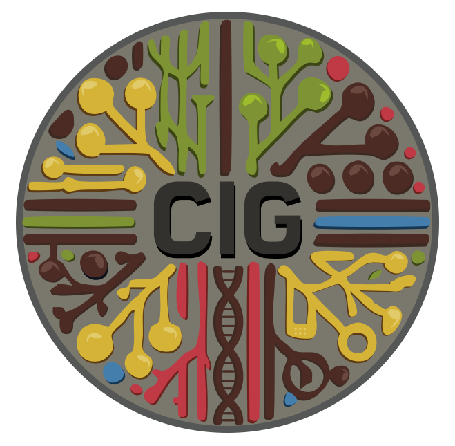

  

# CIG Compute Clinic
CIG Compute Clinic is a bimonthly meeting to discuss pipelines, HPC, and resource usages. The clinic is put on by the Collaborative and Integrative Group at MGI.

## CIG@MGI 
The CIG is a hybrid group with their office in room 5119 in the 4444 building located at 4444 Forest Park Parkway.

### CIG Team
* Juan Macias
* Chad Tomlinson
* Derek Albracht
* Eddie Belter
* John Garza

# Table of contents
* [RIS Storage](https://github.com/twlab/cig-compute-clinic/blob/main/pages/CIG_RIS_Storage.md)
